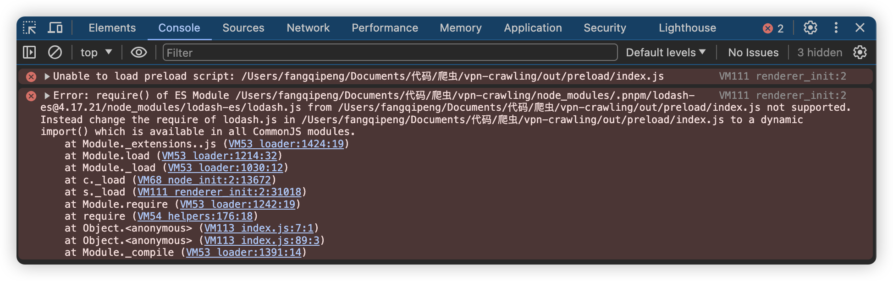
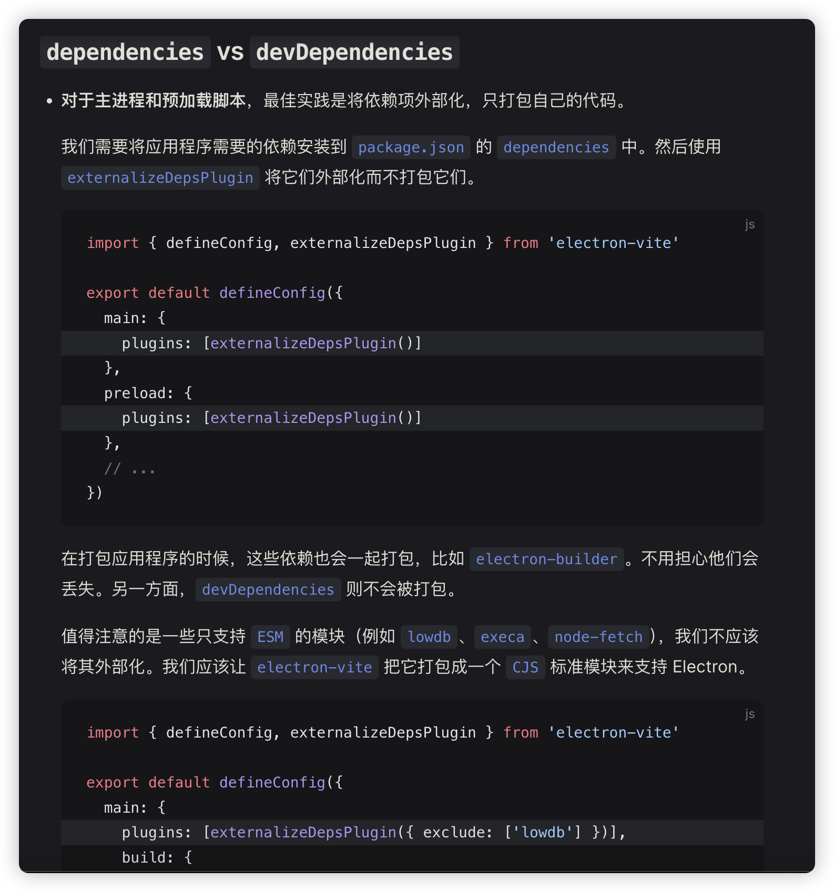

## 1、运行提示：Unable to load preload script...Error: require() of ES Module.../out/preload/index.js to a dynamic import() which is available in all CommonJS modules.

- 详细报错如下：
  

- 原因：

> Electron 应用主要运行在 Node.js 环境中，因此它们通常使用 CommonJS 模块，对于一些只支持 ESM 的模块（例如 lowdb、execa、node-fetch），如果您尝试将它们外部化，可能会遇到问题，因为 Electron 主进程默认使用的是 CommonJS 模块系统。这就是为什么建议使用 electron-vite 将这些 ESM 模块打包成 CJS 模块的原因。这样做可以确保这些模块能够在 Electron 主进程中正常工作，因为它们将被转换成兼容的格式。
> 何为“外部化”？在打包应用程序时，通常会有一个“外部化”的概念，即把某些库留在打包结果之外，并在运行时动态加载。这样做可以减少打包体积，加快构建速度，但前提是外部化的库在运行环境中可用。

- electron-vite 官网文档说明 [→](https://cn.electron-vite.org/guide/dev)
  

- 本项目的解决方案：

> 将报错的模块排除 exclude: ['lodash-es', 'nanoid', 'validator']

```javascript
// electron.vite.config.ts
preload: {
  plugins: [
    externalizeDepsPlugin({
      exclude: ['lodash-es', 'nanoid', 'validator']
    })
  ],
  ...
}
```
